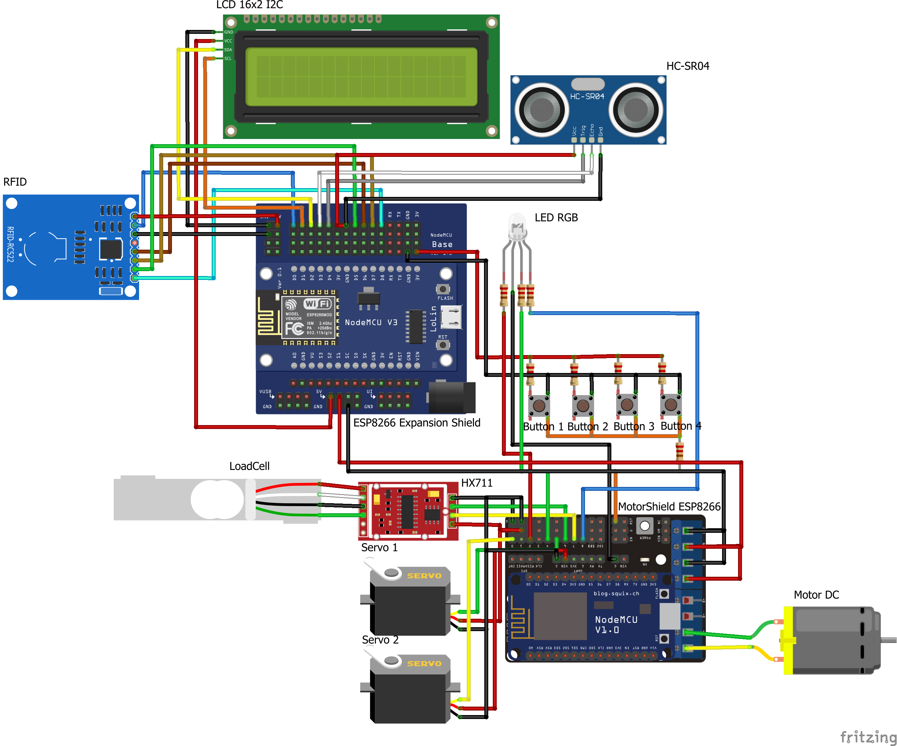

# Cat-Feeder
My Group project on Uni for PKL study assigment

On this project we have two esp8266 with difference use. Why not using ESP32? nah, i thought we can't change the component we use on this assignment. when already committed they says we can just change it. Bruh what a momment.

## What Code we use?
  The first ESP8266 was uses for the RFID, and other minor component as LED, LCD, Additional Servo, and others.
    Use the latest code <a href="/firstesp8266/firstesp8266_3.1/firstesp8266_3.1.ino"> Click This Text </a> for the esp code. if u have esp32 just added the code into yours, but don't forget to configure it.

  The second ESP8266 was uses for mechanism as like the main servo, weighter, motor and others. <a href="/secondesp8266/secondesp8266_4.1/secondesp88266_4.1.ino" >Use the latest code for the second too. </a>

## How to Connect em phisically?
  
Just try to analyze this image.
